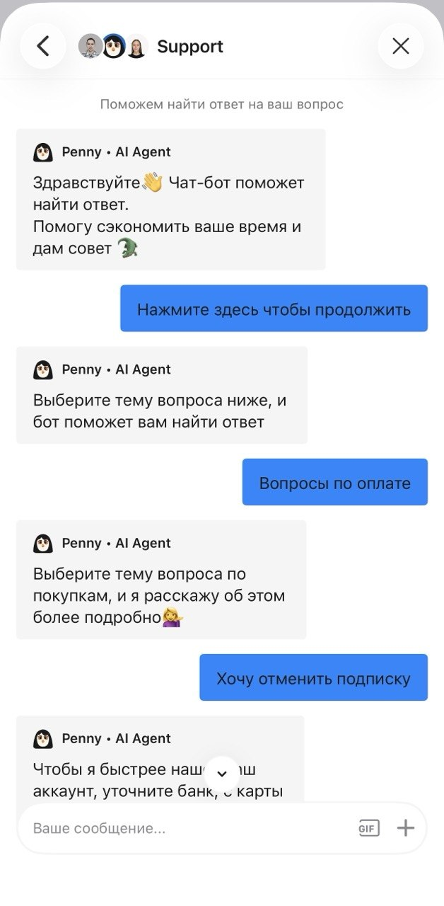
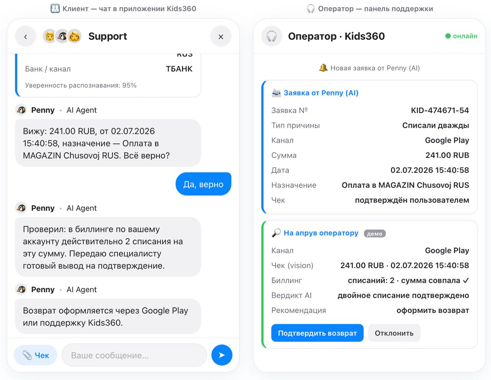

# Kids360 Support Bot — Penny 2.0

**AI-ветка возврата средств при двойном списании** — прототип для одной, самой проблемной ветки чат-бота поддержки Kids360.

Родитель, с которого дважды списали за детскую подписку, приходит расстроенным. Penny 2.0 понимает
суть **свободным текстом**, сам **читает скриншот чека** (vision), сверяет двойное списание с биллингом
и отдаёт оператору **готовый вердикт на апрув**. Оператор из «читателя чеков» превращается в «апрувера» —
это прямая **разгрузка специалистов L1** и рост доли автозакрытий (deflection), без галлюцинаций в
платёжной теме.

### 🔗 Живой прототип: **https://kids360.naimis.ru**

На той же странице — все три части задания: **аудит** текущего бота, **проектирование** новой ветки и
рабочий **чат-прототип**, который можно потрогать. LLM-вызов реальный (OpenAI `gpt-4o`), не заглушка.

---

## Что это решает

| | Текущий Penny | Penny 2.0 |
|---|---|---|
| Первый вопрос | банк карты | **причина + канал подписки** (важнее банка) |
| Отказ по п. 11.13 | сразу, до выяснения причины | только для «за неиспользованное время» |
| Чек | родитель добывает в банке, оператор читает **глазами** | родитель прикладывает, **AI читает** (vision) |
| Двойное списание | оператор сверяет вручную | **сверка с биллингом** → готовый вердикт |
| Роль оператора | читатель чеков + исполнитель | **апрувер** (подтвердить/отклонить) |

Прототип показан в **двух зеркальных окнах**: слева — чат родителя, справа — панель оператора
(как в Service Desk / Intercom) с заявкой и вердиктом на апрув. Видно, как AI собирает решение,
а человек только подтверждает.

### Было → стало

**Было** — текущий Penny гонит по кнопкам и спрашивает **банк карты** вместо канала подписки, а отказ
по п. 11.13 выдаёт ещё до выяснения причины:



**Стало** — родитель описывает проблему словами, прикладывает чек одной кнопкой, AI читает и сверяет
с биллингом, а оператор получает готовый вердикт и только апрувит (**[потрогать вживую →](https://kids360.naimis.ru)**):



Слева родитель видит дружелюбный диалог; справа оператор получает **заявку от Penny** и карточку
**«на апрув»** с вердиктом биллинга (`списаний: 2 · сумма совпала ✓ → оформить возврат`) и кнопками
«Подтвердить возврат / Отклонить». Решение о деньгах остаётся за человеком.

> Полный аудит всех трёх пройденных веток со скриншотами — на живой странице (секция «Аудит») и в
> [`docs/audit.md`](docs/audit.md).

---

## Часть 1 — Аудит

Прошёл как обычный пользователь вход в чат и **три ветки**: настройка аккаунта, функции приложения,
оплата/возврат. Ветки 1–2 чинятся правками контента и навигации — AI там не обязателен. Выбрал
**ветку возврата**: единственная, где кнопочная механика не решает задачу в принципе, а цена ошибки
максимальна — речь о деньгах родителя.

В этой ветке текущий бот спрашивает **банк карты** и выдаёт пошаговую инструкцию, как достать чек именно
в этом банке, после чего чек уходит на **ручную обработку**. Три корневые проблемы:

- **P1.** Перекладывает труд на растерянного родителя (инструкция «сходи в свой банк»), не масштабируется.
- **P2.** UX-баг: кнопка прикрепления файла спрятана в отдельном сообщении, пользователь застревает.
- **P3.** Чек читает оператор глазами — рутина, которую закрывает vision-модель.

Сильный аргумент выбора ветки: в базе знаний Kids360 есть статьи про отмену/активацию/покупку,
но **нет статьи про возврат** — сценарий держится только на ручном труде саппорта.

→ Подробно: [`docs/audit.md`](docs/audit.md)

---

## Часть 2 — Проектирование

Ключевая идея: **сначала классифицируем причину** (двойное списание / после отмены / незнакомый
платёж / за неиспользованное время), затем выясняем **канал подписки** (важнее банка карты) — отказ
по п. 11.13 применяется только к «за неиспользованное время». Дальше: принять чек → распознать (vision)
→ **сверить с биллингом** факт двойного списания → отдать оператору готовый вердикт на апрув. Диалог —
детерминированная форма-мастер; эскалация — по полю `wants_human` (просьба о человеке/раздражение),
с уже собранным контекстом. Грунтинг строго по базе знаний, возврат не обещаем.

Схема диалога (блок-схема со всеми развилками), **метрики автоматизации** (deflection, точность vision,
доля ложных автозакрытий), edge cases (чек без текста, нечитаемый чек / низкий confidence, эмоциональное
требование вернуть деньги, бонус — канал App Store) и обоснование решения для детского сервиса — в
[`docs/design.md`](docs/design.md). Системный промпт — в [`app/prompts.py`](app/prompts.py).

---

## Часть 3 — Прототип

### Стек
- **Backend:** FastAPI (Python), uvicorn.
- **LLM:** OpenAI `gpt-4o` — вызывается **точечно, в двух точках**: распознавание чека (vision) и разбор свободного текста в поля формы. Кнопочные шаги формы-мастера LLM не трогают — прямая экономия токенов. **Реальный вызов, не заглушка.**
- **Frontend:** одна самодостаточная страница [`static/index.html`](static/index.html) (ванильный JS) — три части (аудит · проектирование · живой прототип), отдаётся тем же сервером. Прототип — **детерминированная форма-мастер на кнопках** в дизайне Penny (не редизайн), со свободным вводом как запасным входом; единственное изменение UX относительно оригинала — явная кнопка загрузки чека. Показан в **двух зеркальных окнах** — клиентский чат и панель оператора (заявка + вердикт на апрув): видно, как AI собирает решение, а человек только подтверждает.
- **Деплой:** Ubuntu VPS, systemd + nginx + certbot.

### Эндпоинты
| Метод | Путь | Назначение |
|---|---|---|
| GET | `/` | Единая страница: 3 части + встроенный чат Penny |
| GET | `/api/config` | Приветственное сообщение бота |
| POST | `/api/chat` | Разбор свободного текста (LLM): `{message, state}` → `{reason, channel, amount, date, wants_human, reply}` |
| POST | `/api/recognize` | Чек (vision): multipart-файл ИЛИ base64 → `{amount, date, purpose, bank_or_channel, raw_text, confidence}` |
| POST | `/api/verify` | Сверка двойного списания с (демо-)биллингом → вердикт оператору. **Без LLM** (детерминированный мок `app/billing.py`) |

> **Архитектура (итерация 2):** диалог — детерминированная **форма-мастер на кнопках** (логика на фронте, без LLM на каждом шаге). LLM вызывается только в **двух точках** — vision (чтение чека) и разбор свободного текста в поля формы. Сверка с биллингом (`/api/verify`) тоже **детерминированная, без LLM** — в прототипе демо-мок `app/billing.py`, в боевой версии здесь был бы запрос к биллингу Kids360 по `account_id` и к App Store Server API / Google Play Developer API по каналу. Итог: AI даёт оператору **готовый вердикт** (двойное списание подтверждено / на проверку), а тот только подтверждает или отклоняет. Дешевле, детерминированнее и без галлюцинаций в платёжной теме; кнопочный флоу не делает ни одного вызова OpenAI.

### Локальный запуск
```bash
# 1. Виртуальное окружение и зависимости
python3 -m venv .venv
source .venv/bin/activate
pip install -r requirements.txt

# 2. Ключ OpenAI (файл .env в git не попадает)
cp .env.example .env
#   и впишите реальный OPENAI_API_KEY в .env

# 3. Запуск
uvicorn app.main:app --reload
#   открыть http://127.0.0.1:8000
```

### Деплой на Ubuntu
```bash
# на сервере, из корня проекта
python3 -m venv .venv
source .venv/bin/activate
pip install -r requirements.txt

# .env с реальным ключом (НЕ из git — создать вручную)
cp .env.example .env && nano .env

# автозапуск через systemd
sudo cp deploy/kids360-bot.service /etc/systemd/system/
#   при необходимости поправить User / WorkingDirectory / путь к .venv в юните
sudo systemctl daemon-reload
sudo systemctl enable --now kids360-bot
sudo systemctl status kids360-bot

# reverse proxy на домен
sudo cp deploy/nginx.conf.example /etc/nginx/sites-available/kids360-bot
#   заменить ТВОЙ_ДОМЕН на реальный домен
sudo ln -s /etc/nginx/sites-available/kids360-bot /etc/nginx/sites-enabled/
sudo nginx -t && sudo systemctl reload nginx

# бесплатный HTTPS (Let's Encrypt)
sudo apt install certbot python3-certbot-nginx
sudo certbot --nginx -d ТВОЙ_ДОМЕН
```
Конфиги: [`deploy/kids360-bot.service`](deploy/kids360-bot.service), [`deploy/nginx.conf.example`](deploy/nginx.conf.example).

---

## Что дальше в продакшене

Прототип намеренно сфокусирован на одной ветке; в боевой версии сюда встают реальные интеграции:

- **Биллинг:** заменить демо-мок `app/billing.py` на реальный запрос к биллингу Kids360 по `account_id`
  (внутренний API / SQL) + **App Store Server API** и **Google Play Developer API** по каналу — чтобы
  вердикт «двойное списание» строился на факте, а не на словах клиента.
- **Service Desk (Intercom):** заявка Penny → тикет оператору; апрув/отклонение → действие в тикете.
- **Метрики в дашборд:** deflection rate, точность распознавания чека, **доля ложных автозакрытий**
  (критичная — цена ошибки в платёжке высока), CSAT по ветке. Метрики и ориентиры — в [`docs/design.md`](docs/design.md).
- **База знаний:** вынести грунтинг в обновляемый источник (helpcenter), чтобы ответы жили вместе с
  реальными статьями Kids360.

---

## Безопасность ключа

- OpenAI-ключ живёт **только** в `.env` на сервере. В репозитории — лишь `.env.example` с плейсхолдером.
- `.env` в `.gitignore` **с первого коммита**. Перед пушем: `git status` — убедиться, что `.env` не в списке.
- Фронт ключа не касается: браузер → свой бэкенд (`/api/*`) → OpenAI. Ключ наружу не выходит.
- Если ключ случайно закоммичен — **отозвать** его в OpenAI и выпустить новый (не «удалить файл»).

---

## Структура репозитория

```
.
├── README.md                  # этот файл
├── LICENSE                    # MIT
├── .env.example               # плейсхолдер ключа (реального .env в git нет)
├── .gitignore
├── requirements.txt
├── app/
│   ├── main.py                # FastAPI: /, /api/chat, /api/recognize, /api/verify, /api/config
│   ├── llm.py                 # обёртка OpenAI: vision + разбор свободного текста, ретраи
│   ├── prompts.py             # INTERPRET_PROMPT + приветствие (+ поведенческая спецификация)
│   ├── billing.py             # сверка двойного списания (демо-мок, /api/verify, без LLM)
│   └── knowledge_base.py      # база знаний Kids360 (грунтинг)
├── static/
│   ├── index.html             # единая страница: 3 части + чат Penny (реплика UI)
│   └── img/                    # врезки-скриншоты для секции «Аудит»
├── docs/
│   ├── audit.md               # Часть 1 — аудит
│   ├── design.md              # Часть 2 — схема диалога + метрики + edge cases
│   └── screenshots/           # скриншоты прохождения бота
└── deploy/
    ├── kids360-bot.service    # systemd-юнит
    └── nginx.conf.example     # nginx reverse proxy
```
